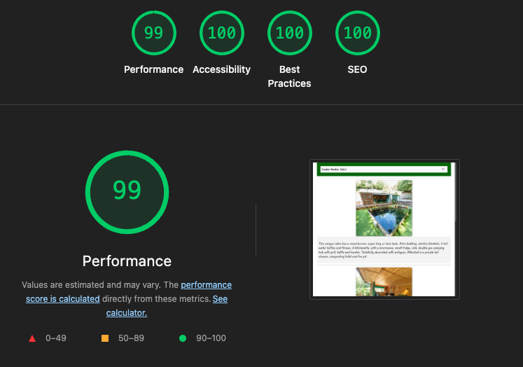

Intro

A landing page built to help with SEO for a holiday property primarily hosted on Air BnB. Deployed using a custom domain with Github Pages hosting the site.

Tech

- Bootsrap 5 - [Bootstrap 5.3.8 CSS & JS Libraries](https://getbootstrap.com/)
- Google Lighthouse for performance and SEO testing
- FreeConvert to convert images to WebP format - [FreeConvert](https://www.freeconvert.com/)
- Convertio to convert images to WebP format - [Convertio](https://convertio.co/)
- Lorem Ipsum placeholder text used during development - [Lorum Ipsum](https://www.lipsum.com/)
- Grok - placeholder ai image generation used during development - [Grok](https://grok.com/)
- Image Compressor - completely free in browser image compression - [Image Compressor](https://imagecompressor.com/)
- Squarespace - custom domains - [Squarespace](https://www.squarespace.com/)

Build

Testing

Basic site responsiveness testing completed using Google Lighthouse

Acknowledgements

- [Reddit subreddit, useful coding advice](https://www.reddit.com/r/webdev/)

- [Stack Overflow, useful coding database](https://stackoverflow.com/questions)